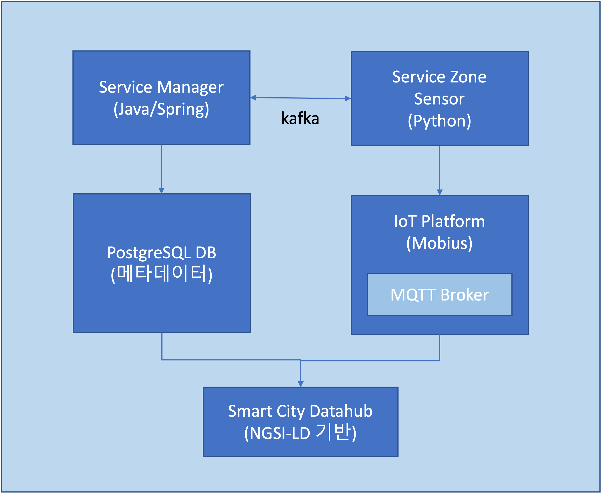
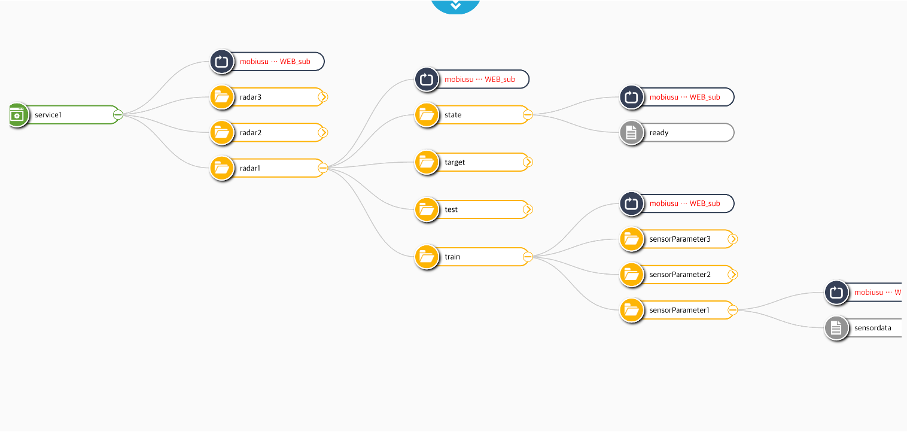
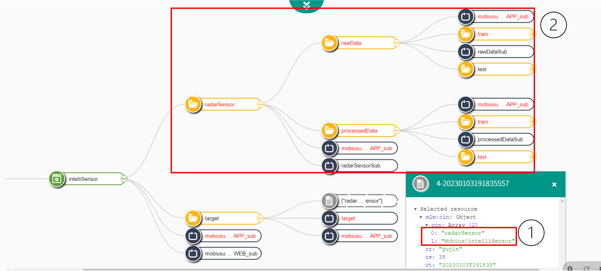
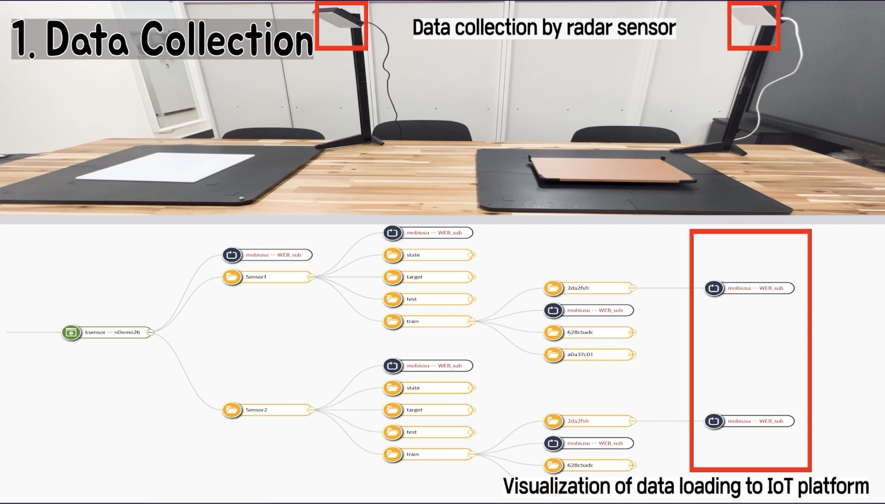

# AIoT 데이터 플랫폼 (AIoT Data Platform)

oneM2M 표준 플랫폼 오픈소스 기반 AI 학습 및 성능 평가 지원 AIoT 데이터 플랫폼


## 목차
- [개요](#개요)
- [시스템 아키텍처](#시스템-아키텍처)
- [주요 모듈](#주요-모듈)
- [기술 스택](#기술-스택)
- [사전 요구사항](#사전-요구사항)
- [설치 및 설정](#설치-및-설정)
- [실행 방법](#실행-방법)
- [API 문서](#api-문서)
- [주요 기능](#주요-기능)

---

## 개요

AIoT 데이터 플랫폼은 AI 모델 학습을 위한 센서 데이터를 수집, 저장, 관리하는 통합 플랫폼입니다. oneM2M 표준을 기반으로 한 IoT 플랫폼(Mobius)과 연동하여 센서 데이터를 수집하고, 이를 AI 학습에 활용할 수 있도록 체계적으로 관리합니다.

### 주요 특징
- oneM2M 표준 기반 IoT 플랫폼 연동
- 학습 데이터의 체계적인 수집 및 저장
- 분산 메시징 시스템(Kafka)을 통한 비동기 데이터 처리
- 센서 데이터 자동 수집 및 전처리
- 학습 데이터셋 자동 생성 및 관리
- RESTful API 기반 서비스 인터페이스

---

## 시스템 아키텍처



본 플랫폼은 크게 **Service Manager**와 **Service Zone Sensor**로 구성되며, 각 모듈은 다음과 같은 역할을 수행합니다:

```
┌─────────────────────────────────────────────────────────────┐
│                     AIoT Data Platform                       │
├─────────────────────────────────────────────────────────────┤
│                                                               │
│  ┌──────────────────┐          ┌─────────────────────┐      │
│  │ Service Manager  │◄────────►│ Service Zone Sensor │      │
│  │   (Java/Spring)  │  Kafka   │     (Python)        │      │
│  └──────────────────┘          └─────────────────────┘      │
│           │                              │                   │
│           │                              │                   │
│           ▼                              ▼                   │
│  ┌──────────────────┐          ┌─────────────────────┐      │
│  │  PostgreSQL DB   │          │  IoT Platform       │      │
│  │     (메타데이터)   │          │    (Mobius)         │      │
│  └──────────────────┘          │  ┌──────────────┐   │      │
│           │                    │  │ MQTT Broker  │   │      │
│           │                    │  └──────────────┘   │      │
│           │                    └─────────────────────┘      │
│           │                              │                   │
│           └──────────────┬───────────────┘                   │
│                          ▼                                   │
│                 ┌─────────────────┐                          │
│                 │   Data Hub      │                          │
│                 │ (NGSI-LD 기반)   │                          │
│                 └─────────────────┘                          │
└─────────────────────────────────────────────────────────────┘
```

---

## 주요 모듈

### 1. Service Manager

**역할**: 전체 데이터 플랫폼의 중앙 관리 및 오케스트레이션

**주요 기능**:
- 서비스 등록 및 프로비저닝
- 데이터 리소스 자동 생성 (IoT Platform 및 Data Hub)
- 센서 파라미터 관리 및 최적화
- 학습 데이터셋 생성 및 관리
- 엔진(센서, ML, 최적화) 실행 제어
- Kafka를 통한 비동기 메시지 브로커링

**기술 스택**:
- Java 17
- Spring Boot 3.1.1
- Spring Data JPA
- Spring WebFlux (비동기 처리)
- PostgreSQL (메타데이터 저장)
- Apache Kafka (메시지 큐)
- Redis (캐싱)
- Swagger/OpenAPI (API 문서화)

**디렉토리 구조**:
```
servicemanager/
├── src/main/java/aisl/ksensor/servicemanager/
│   ├── ServicemanagerApplication.java      # 애플리케이션 진입점
│   ├── config/                             # 설정 (Swagger 등)
│   ├── servicemgmt/                        # 서비스 관리
│   │   ├── controller/                     # REST API 컨트롤러
│   │   ├── service/                        # 비즈니스 로직
│   │   ├── data/                           # 데이터 엔티티 및 DTO
│   ├── dataresource/                       # 데이터 리소스 관리
│   │   ├── service/                        # IoT Platform/Data Hub 연동
│   ├── parameterbroker/                    # 파라미터 브로커 (Kafka)
│   ├── component/                          # 컴포넌트 프로비저닝
│   └── common/                             # 공통 모듈
│       ├── transfer/                       # HTTP/Kafka 통신
│       ├── engine/                         # 엔진 관리
│       └── exception/                      # 예외 처리
└── src/main/resources/
    ├── application.properties              # 애플리케이션 설정
    └── logback-spring.xml                  # 로깅 설정
```

### 2. Service Zone Sensor

**역할**: 센서 데이터 수집 및 IoT Platform과의 실시간 통신

**주요 기능**:
- Kafka 메시지 수신 및 센서 제어
- IoT Platform (Mobius) 센서 데이터 수집 명령 전송
- MQTT를 통한 센서 상태 모니터링
- 수집된 데이터를 Data Hub로 전송
- 학습 데이터(Train/Test) 분리 및 저장

**기술 스택**:
- Python 3.x
- kafka-python (Kafka 클라이언트)
- paho-mqtt (MQTT 클라이언트)
- requests (HTTP 통신)
- numpy (데이터 처리)
- multiprocessing (병렬 처리)

**디렉토리 구조**:
```
serviceZoneSensor/
├── app/
│   ├── main.py                             # 애플리케이션 진입점
│   ├── kafka_broker/                       # Kafka 통신 모듈
│   │   └── common_kafka.py                 # Kafka Producer/Consumer
│   ├── api_util/                           # API 유틸리티
│   │   ├── iot_platform_api_util.py        # IoT Platform API
│   │   ├── data_hub_api_util.py            # Data Hub API
│   │   ├── http_request.py                 # HTTP 요청
│   │   ├── mqtt_request.py                 # MQTT 요청
│   │   └── iot_platform_dto/               # IoT Platform DTO
│   ├── multi_process/                      # 멀티프로세스 처리
│   └── config/                             # 설정 파일
│       └── config.ini                      # 환경 설정
└── requirements.txt                        # Python 의존성
```

---

## 기술 스택

### Service Manager
| 구분 | 기술 | 버전 | 용도 |
|------|------|------|------|
| 언어 | Java | 17 | 애플리케이션 개발 |
| 프레임워크 | Spring Boot | 3.1.1 | 백엔드 프레임워크 |
| 데이터베이스 | PostgreSQL | - | 메타데이터 저장 |
| 메시징 | Apache Kafka | - | 비동기 메시지 큐 |
| 캐싱 | Redis | - | 데이터 캐싱 |
| 빌드 도구 | Maven | - | 의존성 관리 및 빌드 |
| API 문서 | Swagger/OpenAPI | 2.0.0 | API 문서화 |

### Service Zone Sensor
| 구분 | 기술 | 버전 | 용도 |
|------|------|------|------|
| 언어 | Python | 3.x | 애플리케이션 개발 |
| Kafka | kafka-python | 2.0.2 | Kafka 클라이언트 |
| MQTT | paho-mqtt | 1.6.1 | MQTT 통신 |
| HTTP | requests | 2.31.0 | HTTP 통신 |
| 데이터 처리 | numpy | 1.25.2 | 데이터 처리 |

### 외부 시스템
- **IoT Platform**: Mobius (oneM2M 표준 기반)
- **Data Hub**: NGSI-LD 기반 데이터 저장소
- **Message Broker**: Apache Kafka

---

## 사전 요구사항

### 공통 요구사항
- Docker & Docker Compose (선택사항)
- Apache Kafka (203.250.148.120:20517)
- IoT Platform (Mobius) (203.250.148.120:20519)
- Data Hub (203.250.148.119:20517)

### Service Manager 요구사항
- **JDK 17 이상**
  ```bash
  # 설치 확인
  java -version
  # 출력 예시: openjdk version "17.0.x" ...
  ```

- **Maven 3.6 이상**
  ```bash
  # 설치 확인
  mvn -version
  ```

- **PostgreSQL 12 이상**
  - Host: localhost
  - Port: 5431
  - Database: intelligence_sensor_platform
  - Schema: service_manager
  - Username: postgres
  - Password: postgres

- **Redis**
  - Host: localhost
  - Port: 6379

### Service Zone Sensor 요구사항
- **Python 3.8 이상**
  ```bash
  # 설치 확인
  python3 --version
  # 출력 예시: Python 3.8.x
  ```

- **pip** (Python 패키지 관리자)

---

## 설치 및 설정

### 1. 프로젝트 클론

```bash
git clone <repository-url>
cd AIoT_dataplatform
```

### 2. Service Manager 설정

#### 2.1 의존성 설치

```bash
cd servicemanager
mvn clean install
```

#### 2.2 데이터베이스 설정

PostgreSQL 데이터베이스 생성:

```sql
CREATE DATABASE intelligence_sensor_platform;
\c intelligence_sensor_platform
CREATE SCHEMA service_manager;
```

#### 2.3 설정 파일 수정

`servicemanager/src/main/resources/application.properties` 파일을 환경에 맞게 수정:

```properties
# 서버 포트
server.port=9090

# 데이터베이스 설정
spring.datasource.url=jdbc:postgresql://localhost:5431/intelligence_sensor_platform?currentSchema=service_manager
spring.datasource.username=postgres
spring.datasource.password=postgres

# Kafka 설정
kafka.bootstrap-server=203.250.148.120:20517

# Redis 설정
spring.data.redis.host=localhost
spring.data.redis.port=6379

# IoT Platform URL
url.iotplatform.http=http://203.250.148.120:20519
url.iotplatform.mqtt=mqtt://203.250.148.120

# Data Hub URL
url.iotdatahub.http=http://203.250.148.119:20517
```

### 3. Service Zone Sensor 설정

#### 3.1 의존성 설치

```bash
cd serviceZoneSensor
pip install -r requirements.txt
```

또는

```bash
pip3 install certifi==2023.7.22
pip3 install charset-normalizer==3.2.0
pip3 install idna==3.4
pip3 install kafka-python==2.0.2
pip3 install numpy==1.25.2
pip3 install paho-mqtt==1.6.1
pip3 install requests==2.31.0
pip3 install urllib3==2.0.4
```

#### 3.2 설정 파일 수정

`serviceZoneSensor/app/config/config.ini` 파일을 환경에 맞게 수정:

```ini
[COMMON]
ENGINE_TYPE = sensor-controller

[KAFKA]
KAFKA_HOST = 203.250.148.120
KAFKA_PORT = 20517
KAFKA_REQUEST_TOPIC = notification.request.controller.sensor
KAFKA_RESPONSE_TOPIC = notification.response.controller.sensor
KAFKA_GROUP_ID = sensor_controller

[API]
IOTTPLATFORM_URL_HOST = 203.250.148.120
IOTPLATFORM_HTTP_PORT = 20519
IOTPLATFORM_MQTT_PORT = 20516
IOTPLATFORM_URL_HTTP = http://{}:{}/Mobius/
IOTPLATFORM_URL_MQTT = mqtt://{}:{}/{}/ct=json
DATAHUB_URL_HOST_INGEST_ENDPOINT = http://203.250.148.119:20516/entityOperations/upsert
```

#### 3.3 환경 변수 설정

Service Zone Sensor는 다음 환경 변수가 필요합니다:

```bash
export SERVICE_ID=<서비스_ID>
export SENSOR_TYPE=<센서_타입>
```

예시:
```bash
export SERVICE_ID=parking_service_01
export SENSOR_TYPE=ParkingSpot
```

---

## 실행 방법

### 1. 인프라 실행 (사전 준비)

다음 서비스들이 실행 중이어야 합니다:
- PostgreSQL
- Redis
- Apache Kafka
- IoT Platform (Mobius)
- Data Hub

### 2. Service Manager 실행

#### 방법 1: Maven을 이용한 실행

```bash
cd servicemanager
mvn spring-boot:run
```

#### 방법 2: JAR 파일 빌드 후 실행

```bash
cd servicemanager
mvn clean package
java -jar target/servicemanager-0.0.1-SNAPSHOT.jar
```

실행 확인:
```bash
# Swagger UI 접속
http://localhost:9090/api-docs
```

### 3. Service Zone Sensor 실행

```bash
cd serviceZoneSensor/app
export SERVICE_ID=<서비스_ID>
export SENSOR_TYPE=<센서_타입>
python3 main.py
```

실행 로그 예시:
```
2024-11-20 10:00:00,000 - parking_service_01's sensor-controllerLogger - INFO - Service ID: parking_service_01
2024-11-20 10:00:01,000 - parking_service_01's sensor-controllerLogger - INFO - Kafka consumer connected
```

---

## API 문서

Service Manager는 Swagger UI를 통해 API 문서를 제공합니다.

### Swagger UI 접속

```
http://localhost:9090/api-docs
```

### 주요 API 엔드포인트

#### 1. 서비스 등록 및 프로비저닝

**POST** `/setup`

서비스를 등록하고 필요한 데이터 리소스를 자동으로 생성합니다.

**Request Body**:
```json
{
  "serviceId": "parking_service_01",
  "sensorType": "ParkingSpot",
  "sensorParam": [
    {
      "sensor_01": {
        "param1": {
          "min": 0,
          "max": 100
        }
      }
    }
  ],
  "optimizationParam": {},
  "hyperParam": {},
  "filterParam": {},
  "sensingStopCondition": {
    "type": "count",
    "value": 1000
  },
  "sensorTargets": []
}
```

**Response**: 200 OK

생성되는 리소스:
- IoT Platform에 AE, Container, Subscription 리소스 생성
- Data Hub에 Dataset 및 DataFlow 생성
- PostgreSQL에 서비스 메타데이터 저장



#### 2. 엔진 실행

**POST** `/run/{serviceType}`

특정 엔진(센서, ML, 최적화)을 실행합니다.

**Path Parameters**:
- `serviceType`: 실행할 엔진 타입 (예: `sensor-controller`, `ml-engine`, `optimization-engine`)

**Request Body**:
```json
{
  "serviceId": "parking_service_01"
}
```

**Response**: 200 OK

#### 3. 최적화 파라미터 업데이트

**POST** `/update/parameters`

서비스의 최적화 파라미터를 업데이트합니다.

**Request Body**:
```json
{
  "serviceId": "parking_service_01",
  "sensorParam": {
    "sensor_01": {
      "frequency": 10
    }
  },
  "filterParam": {},
  "hyperParam": {}
}
```

**Response**: 200 OK

---

## 주요 기능

### 1. 서비스 프로비저닝



서비스 등록 시 다음 작업이 자동으로 수행됩니다:

1. **IoT Platform 리소스 생성**
   - Application Entity (AE): 서비스의 루트 리소스
   - Container (CNT): 센서별 데이터 컨테이너
     - Train Data Container
     - Test Data Container
     - Target Container (센서 제어용)
     - State Container (센서 상태용)
   - Subscription (SUB): 센서 상태 변경 알림

2. **Data Hub 리소스 생성**
   - Dataset: 학습 데이터셋 메타데이터
   - DataFlow: 데이터 저장 플로우 설정

3. **데이터베이스 저장**
   - 서비스 메타데이터
   - 센서 파라미터 범위
   - 최적화 설정

### 2. 센서 데이터 수집



데이터 수집 프로세스:

1. Service Manager가 Kafka 메시지를 통해 센서 수집 명령 전송
2. Service Zone Sensor가 메시지 수신
3. 각 센서에 대해:
   - Target Container에 수집 파라미터 전송 (HTTP)
   - State Subscription을 통해 센서 준비 상태 모니터링 (MQTT)
   - 센서 데이터 수집 완료 대기
4. 수집된 데이터를 Data Hub로 전송
   - Train Data와 Test Data 분리 저장
   - NGSI-LD 포맷으로 변환
5. 완료 메시지를 Kafka를 통해 Service Manager로 전송

### 3. 데이터 리소스 관리

학습 데이터는 다음과 같이 구조화되어 관리됩니다:

```
IoT Platform (Mobius)
└── ServiceID (AE)
    └── SensorID (CNT)
        ├── train (CNT)
        │   └── {paramId} (CNT)
        │       └── data (CIN)
        ├── test (CNT)
        │   └── {paramId} (CNT)
        │       └── data (CIN)
        ├── target (CNT)
        │   └── {serviceId}{sensorId} (SUB)
        └── state (CNT)
            └── {serviceId}{sensorId}_state (SUB)

Data Hub
├── {serviceId}{sensorId}_train_{paramId} (Dataset)
├── {serviceId}{sensorId}_test_{paramId} (Dataset)
├── {serviceId}{sensorId}_train_filter_{paramId} (Dataset)
└── {serviceId}{sensorId}_test_filter_{paramId} (Dataset)
```

### 4. 비동기 메시징 (Kafka)

모듈 간 통신은 Kafka를 통해 비동기로 처리됩니다:

**Topics**:
- `notification.request.controller.sensor`: 센서 제어 요청
- `notification.response.controller.sensor`: 센서 응답

**메시지 포맷**:
```json
{
  "eventId": "uuid",
  "eventTransId": "transaction-id",
  "fromSystemName": "EAI",
  "toSystemName": "sensor-controller",
  "contentType": "application/json",
  "messageType": "request",
  "content": {
    "serviceId": "parking_service_01",
    "sensorParam": {},
    "dataResourceInformation": {},
    "sensingStopCondition": {}
  }
}
```

### 5. 최적화 반복 (Optimization Iteration)

AI 모델 최적화를 위한 반복 실행 지원:

1. 초기 서비스 등록 (`optIter = 0`)
2. 센서 데이터 수집 및 ML 학습 실행
3. 최적화 엔진이 새로운 파라미터 제안
4. 파라미터 업데이트 (`optIter++`)
5. 새로운 데이터셋 생성 및 재학습
6. 2-5 반복

---

## 데이터 플로우

### 전체 데이터 플로우

```
┌──────────────┐      1. Setup      ┌─────────────────┐
│              │◄───────────────────│   Service       │
│  IoT         │                    │   Manager       │
│  Platform    │                    └────────┬────────┘
│  (Mobius)    │                             │
└──────┬───────┘                             │
       │                                     │
       │ 2. Sensing Command                  │ 3. Kafka Request
       │    (HTTP POST)                      │
       │                                     ▼
       │                          ┌─────────────────────┐
       │    4. MQTT Subscribe     │  Service Zone       │
       │◄─────────────────────────┤  Sensor             │
       │                          └─────────────────────┘
       │                                     │
       │ 5. Sensing Data                    │
       │    (CIN Creation)                  │
       │                                     │
       ├────────────────────────────────────┤
       │                                     │
       │ 6. Collect Data (HTTP GET)         │
       │◄────────────────────────────────────┤
       │                                     │
       │                                     │ 7. Store Data
       │                                     │    (HTTP POST)
       │                                     ▼
       │                          ┌─────────────────────┐
       │                          │   Data Hub          │
       │                          │   (NGSI-LD)         │
       │                          └─────────────────────┘
       │                                     │
       │ 8. Kafka Response                  │
       └────────────────────────────────────┘
```

---

## 개발 가이드

### Service Manager 개발

#### 새로운 엔티티 추가

1. `src/main/java/aisl/ksensor/servicemanager/servicemgmt/data/entity/` 에 엔티티 클래스 추가
2. Repository 인터페이스 생성
3. DAO 구현
4. Service 레이어에 비즈니스 로직 추가
5. Controller에 API 엔드포인트 추가

#### 로깅

```java
@Slf4j
public class YourClass {
    public void yourMethod() {
        log.info("Info message");
        log.error("Error message", exception);
    }
}
```

### Service Zone Sensor 개발

#### 새로운 API 유틸리티 추가

`serviceZoneSensor/app/api_util/` 디렉토리에 새 모듈 추가:

```python
import requests

def your_api_function(url, data):
    response = requests.post(url, json=data)
    return response.json()
```

#### 로깅

```python
import logging

logger = logging.getLogger(__name__)
logger.info("Info message")
logger.error(f"Error message: {error}")
```

---

## 트러블슈팅

### Service Manager

#### 1. 데이터베이스 연결 실패

**증상**: `Connection refused` 또는 `Connection timeout`

**해결**:
```bash
# PostgreSQL 실행 확인
sudo systemctl status postgresql

# 포트 확인
netstat -an | grep 5431
```

#### 2. Kafka 연결 실패

**증상**: `Failed to connect to Kafka broker`

**해결**:
```bash
# Kafka 서버 확인
telnet 203.250.148.120 20517

# application.properties 설정 확인
kafka.bootstrap-server=203.250.148.120:20517
```

### Service Zone Sensor

#### 1. 환경 변수 미설정

**증상**: `KeyError: 'SERVICE_ID'`

**해결**:
```bash
export SERVICE_ID=your_service_id
export SENSOR_TYPE=your_sensor_type
python3 main.py
```

#### 2. MQTT 연결 실패

**증상**: `MQTT connection failed`

**해결**:
- `config.ini`의 MQTT 설정 확인
- IoT Platform의 MQTT 브로커가 실행 중인지 확인

---

## 라이선스

본 프로젝트는 [LICENSE](LICENSE) 파일을 참조하세요.

---

## 참고 자료

- [oneM2M 표준](http://www.onem2m.org/)
- [Mobius IoT Platform](https://github.com/IoTKETI/Mobius)
- [NGSI-LD](https://www.etsi.org/deliver/etsi_gs/CIM/001_099/009/01.04.01_60/gs_cim009v010401p.pdf)
- [Spring Boot Documentation](https://spring.io/projects/spring-boot)
- [Apache Kafka Documentation](https://kafka.apache.org/documentation/)
